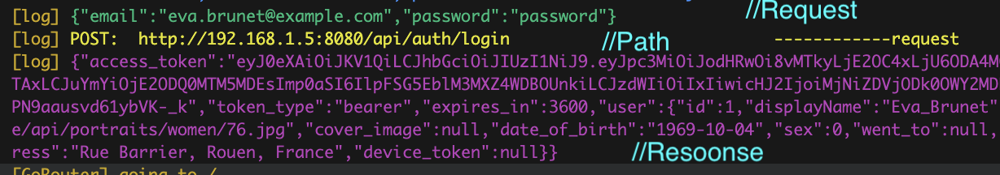
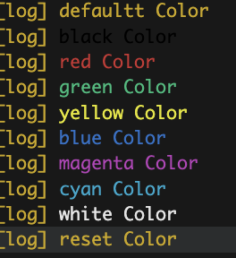

# Feature

- Extension: Support extension for all class
- DioNetworkService: Support call api with dio
- StorageService: Support save data to local storage
- NetworkConnectivityService: Check network connection
- TranslationController: Support translate multi language
- ThemeController: Support change theme light/dark
- AppException: Handle exception and log to ErrorScreen
- BaseConfigs: Configs ThemeState, GoRouter, AssetsPath, more default app need
- BaseResponsiveMixin: You can implement responsive for your app
- Helper:

  - tryFormatDateTime: Format date time, return empty string if error
  - defaultFormatDateTime: Format "yyyy-MM-dd HH:mm:ss"
  - formatNumber: ex: 1234567 => 1,234,567
  - limitShowList:
  - randomNumber: Generate random number
  - readFileJson: Read file json from assets
  - containsToLowerCase: Check contains string ignore case
  - generateIdFromDateTimeNow: Generate id from DateTime.now()
  - convertToListMap: cast list to list map (List<dynamic> => List<Map<String, dynamic>>)
  - getInfoDevice: return String info of device (use in ErrorScreen)
  - formatJsonString: Print Log Json String
  - toMessageError: default handle parse message error from response
  - getWeekNumber: Get week number from DateTime
  - getFirstDateOfWeek: Get first date of week from DateTime
  - toggleFullScreenMode: Toggle full screen mode (Switch to landscape or portrait)
  - hideStatusBarAndNavigationBar: Hide status bar and navigation bar
  - splitJsonStringFromRawResponse: for AI response Json => parse it to object

- HelperWidget:
  - showToastError
  - highlightOccurrences: Hightlight text when search
  - imageProviderFrom, imageWidget: Support auto load image from Url, File, Svg and cache it.
  - showCustomAlertDialog:
  - showSearchDropDown: UI better than DropdownButton (allow filter)
- HelperReflect: support reflect for class (apply filter)
- LimitRangeTextInput: Limit input text with range

## SetUp main.dart

```dart
void main() => runMain(
      configs: MyConfigs(),
      onInit: () async {
        // Load environment variables
        await dotenv.load();
        // Config allow call api "http" client if needed
        HttpOverrides.global = MyHttpoverrides();
        await _initSingletons();
      },
    );

class MyConfigs extends BaseConfigs {
  @override
  String get appTitle => AppConstants.appName;

  @override
  GoRouter router(BuildContext context) => goRouterProvider;

  @override
  AssetsPath get assetsPath => AssetsPath(imageError: Assets.images.logo.logoRemovebg.path);

  @override
  ThemeState get themeState => ThemeState(lightTheme: AppTheme.lightTheme, darkTheme: AppTheme.darkTheme);

  // more configs override here in class BaseConfigs
}

Future<void> _initSingletons() async {
   // Register all the singletons
  GetIt.instance.registerLazySingleton<DioNetworkService>(() => DioNetworkService());
}

// cho phép truy cập vào các trang web không an toàn vd: (localhost ip >> 0.0.0.0)
class MyHttpoverrides extends HttpOverrides {
@override
HttpClient createHttpClient(SecurityContext? context) {
return super.createHttpClient(context)..badCertificateCallback = (X509Certificate cert, String host, int port) => true;
   }
}

```

## Setup DioNetworkService

```dart
class DioNetworkService extends BaseDioNetworkService with DioNetworkServiceMixin, NetworkExceptionHandleMixin {
  DioNetworkService() {
    onInit();
  }

  @override
  String get baseUrl {
    // your environment  url here
    if (kDebugMode) return AppEnvironment.dev.url;
    return AppEnvironment.prod.url;
  }

  @override
  String get apiKey => LoginController.user?.token ?? '';
}

```

If you want to call API, i suggest you use function 'onRequest'

```dart

import 'package:dartz/dartz.dart';
import 'package:flutter_core_datz/flutter_core_datz.dart';
import 'package:get_it/get_it.dart';
import '../shared/network/dio_network_service.dart'; // your DioNetworkService

// base_remote_datasource.dart
typedef FutureEitherAppException<T> = Future<Either<AppException, T>>;

abstract class BaseRemoteDataSource {
  // final apiCall = GetIt.instance<DioNetworkService>();
  final apiCall = GetIt.instance<DioNetworkService>();
}

// // authentication_remote_datasource.dart
class AuthenticationRemoteDataSource extends BaseRemoteDataSource {
  FutureEitherAppException<UserModel> login(UserModel request) async {
    final result = AppException().handleExceptionAsync(() async {
      final json = await apiCall.onRequest(
        '/login',
        RequestMethod.POST,
        body: request,
      );
      return UserModel.fromJson(json);
    });
    return result;
  }
}

// folder /model
class UserModel extends BaseModel<UserModel> {
  String? username;
  String? password;
  String? token;

  UserModel({this.username, this.password, this.token});

  factory UserModel.fromJson(Map<String, dynamic> json) {
    return UserModel(
      username: json['username'],
      password: json['password'],
      token: json['token'],
    );
  }

  @override
  UserModel fromJson(Map<String, dynamic> json) => UserModel.fromJson(json);

  @override
  Map<String, dynamic> toJson() {
    return {
      'username': username,
      'password': password,
      'token': token,
    };
  }
}

```

## AppGlobals

| Property                    | Description                   |
| --------------------------- | ----------------------------- |
| AppGlobals.kTestMode        | Get test mode                 |
| AppGlobals.rootNavigatorKey | Get root navigator key        |
| AppGlobals.context          | Get context of root navigator |

## Printt

Automatically Printt the color of the API when you make a Request and receive a Response

Use it like the `print()` function in Dart to pass parameters

```dart
import 'package:flutter_core_datz/flutter_core_datz.dart';

void printColor(){
    Printt.defaultt("defaultt Color");
    Printt.black("black Color");
    Printt.red("red Color");
    Printt.green("green Color");
    Printt.yellow("yellow Color");
    Printt.blue("blue Color");
    Printt.magenta("magenta Color");
    Printt.cyan("cyan Color");
    Printt.white("white Color");
    Printt.reset("reset Color");
}
```



# Setting VSCODE

```json
"dart.lineLength": 150,
"dart.maxLogLineLength": 150,
"dart.previewFlutterUiGuides": true,
"editor.codeActionsOnSave": {
  "source.addMissingImports": "explicit",
  "source.addMissingRequiredArguments": "explicit",
  "source.addMissingRequiredNamedArguments": "explicit",
  "source.fixAll": "explicit",
  "source.organizeImports": "explicit"
},
"editor.formatOnSave": true,
"editor.formatOnType": true,
```

### Dependency Injection

get_it is used for dependency injection, ensuring the application is decoupled and modular.

### Networking

Dio is employed to facilitate remote API calls, enhancing the efficiency of data retrieval.

### Local Database

Isar is utilized for local database storage, enabling seamless offline access to previously viewed movies.

### Functional Programming

Dartz library is integrated to introduce functional programming concepts, resulting in more predictable and expressive code.

## Getting Started

To set up this application on your local machine, follow these steps:

1. **Clone the Repository:** Open a terminal and run the following command to clone the project repository

2. Install project dependencies:
   ```bash
   flutter clean && flutter pub cache clean --force && rm pubspec.lock && flutter pub get --no-example
   ```
3. Generate LocaleKeys:

   ```bash
   flutter pub run easy_localization:generate -S assets/translations -f keys -o locale_keys.g.dart
   ```

4. Generate necessary code using `build_runner`:
   ```bash
   flutter pub run build_runner build --delete-conflicting-outputs
   ```

## Contributions

Contributions are welcome! If you want to contribute to the Flutter Movie Application, simply follow these steps:

1. Fork the repository.
2. Create a new branch for your feature or bug fix: `git checkout -b feature/your-feature-name` or `bugfix/issue-number`.
3. Make your changes and commit them: `git commit -m 'Add some feature'`.
4. Push your changes to the branch: `git push origin feature/your-feature-name`.
5. Open a pull request against the `master` branch of the original repository.

Your contributions help enhance the FilmKu Flutter Movie Application. Feel free to propose new features, improve existing ones, or fix bugs. Together, we can make FilmKu even better!

### Generate model

Sometime you need generate model from tool [GetCLI](https://github.com/phatdat-dev/get_cli_basemodel_generator)

```bash
get generate model on models/response with assets/import_response.json --copyWith
# or
get generate model with assets/import_response.json
```

#### Install GETCLI

After clone [GetCLI](https://github.com/phatdat-dev/get_cli_basemodel_generator) you need run command below

```bash
dart pub global activate --source path .
```

get file .bat from `%USERPROFILE%\AppData\Local\Pub\Cache\bin`

### Commit message

- Feat (feature): một chức năng mới của dự án
- Fix: fix bug của dự án
- Chore: từ này dịch ra tiếng Việt là việc "lặt vặt" nên mình đoán là nó để chỉ những thay đổi không đáng kể trong code (ví dụ như thay đổi text chẳng hạn), vì mình cũng ít khi sử dụng type này.
- Refactor: refactor lại code hiện tại của dự án (refactor hiểu đơn giản là việc "làm sạch" code, loại bỏ code smells, mà không làm thay đổi chức năng hiện có)
- Docs: thêm/sửa đổi document của dự án (update readme)
- Style: thay đổi UI của dự án mà không ảnh hưởng đến logic.
- Test: thêm/sửa đổi test của dự án
- Perf: cải thiện hiệu năng của dự án (VD: loại bỏ duplicate query, ...)
- CI: cấu hình CI/CD cho dự án
- Build: những thay đổi ảnh hưởng đến hệ thống xây dựng hoặc các phần phụ thuộc bên ngoài
- Vendor: cập nhật phiên bản cho các packages, dependencies mà dự án đang sử dụng.

## Update

### Package [origin link](https://stackoverflow.com/questions/57764070/how-to-automatically-upgrade-flutter-dependencies)

```bash
# flutter clean
# flutter pub cache clean
# rm pubspec.lock
# flutter pub upgrade --major-versions
```

### IOS

[Click](https://stackoverflow.com/questions/59362862/flutter-ios-build-failed-an-error-of-pod-files-podfile-is-out-of-date)

```bash
# cd ios
# pod install --repo-update
# pod repo update
# pod install

# cd ios && pod install --repo-update && cd ..
```

## Build

```bash
flutter build apk --release --split-per-abi
```
